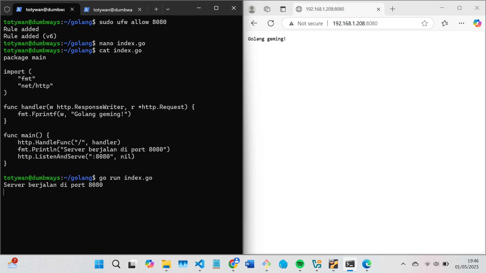

# 📘 Day 5 - CHALLENGE

## NodeJS + Python berjalan di background (tanpa kondisi attached di terminal)

### Step by step menggunakan PM2:

- Install PM2 dengan perintah

```bash
npm install pm2 -g
```

- pindah ke direktori app Node.js yang ingin dijalankan menggunakan pm2 dengan menjalankan perintah berikut:

```bash
cd wayshub-frontend
pm2 start npm --name node.js -- start
```


- Jalankan pm2 pada app python yang ingin dijalankan dengan perintah:

```bash
cd python
pm2 start index.py --name python --interpreter python3
```


- Untuk mematikan pm2 dapat dengan menggunakan `pm2 stop all` sedangkan `pm2 kill` untuk menghapus app yang dijalankan di pm2
- Agar aplikasi tetap jalan walau terminal ditutup dapat jalankan perintah

```bash
pm2 startup
pm2 save
```


---

## Golang bisa dibuka di browser

1. buat file index.go yang berisi:

```bash
package main

import (
    "fmt"
    "net/http"
)

func handler(w http.ResponseWriter, r *http.Request) {
    fmt.Fprintf(w, "Golang geming!")
}

func main() {
    http.HandleFunc("/", handler)
    fmt.Println("Server berjalan di port 8080")
    http.ListenAndServe(":8080", nil)
}
```

2. jalankan file tersebut dengan perintah `go run nama_file.go`
   
