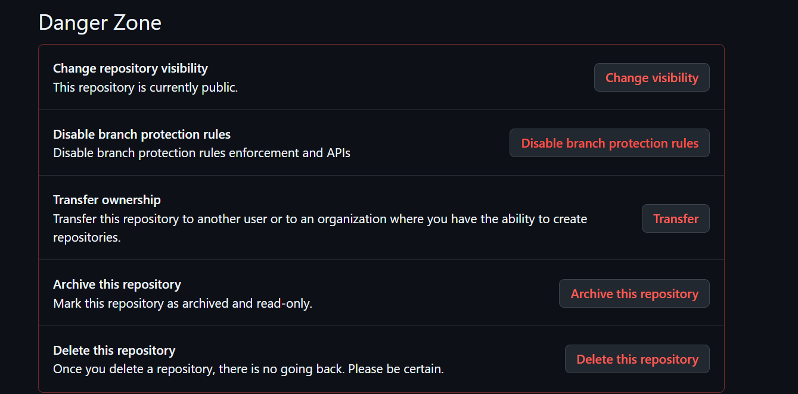
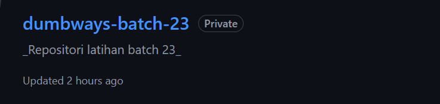
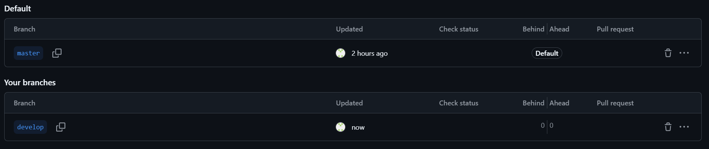
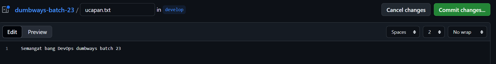
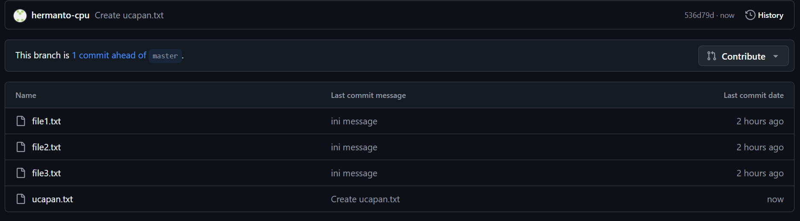
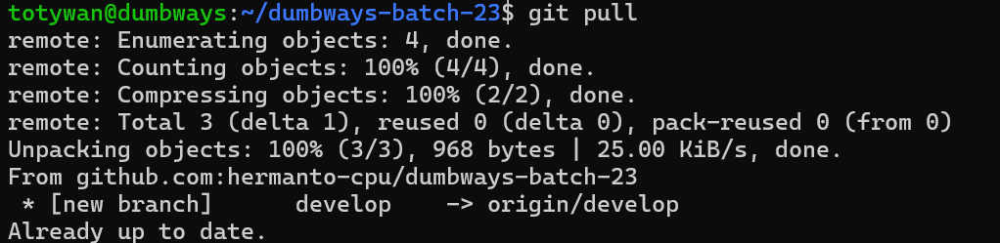
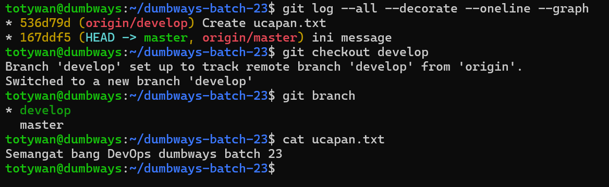

# 📘 Day 4 - CHALLENGE

## Repository dumbways-batch-23 dibuat private

### Step by step:

1. Buka GitHub.
2. Masuk ke repo dumbways-batch-23.
3. Klik tab Settings.
4. Scroll ke bagian Danger Zone.
5. Klik tombol Change repository visibility.
6. Pilih Make private -> Konfirmasi.
   
   

---

## Demokan penggunaan Pull Request

### Step by step:

1. Buat branch baru dan file baru di repository github
   
   
   

2. Setelah selesai pull di lokal dengan perintah pada gambar agar melakukan pull request di semua branch yang ada di repo
   
3. Repository sudah up to date!
   

---
