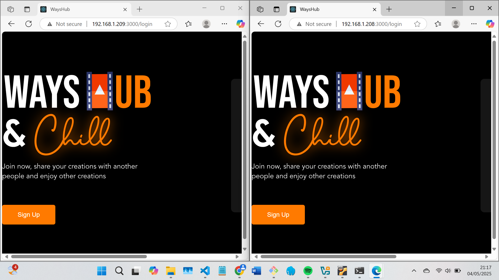
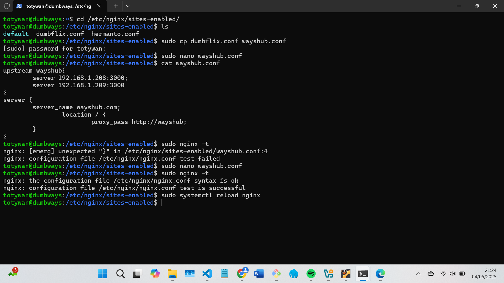
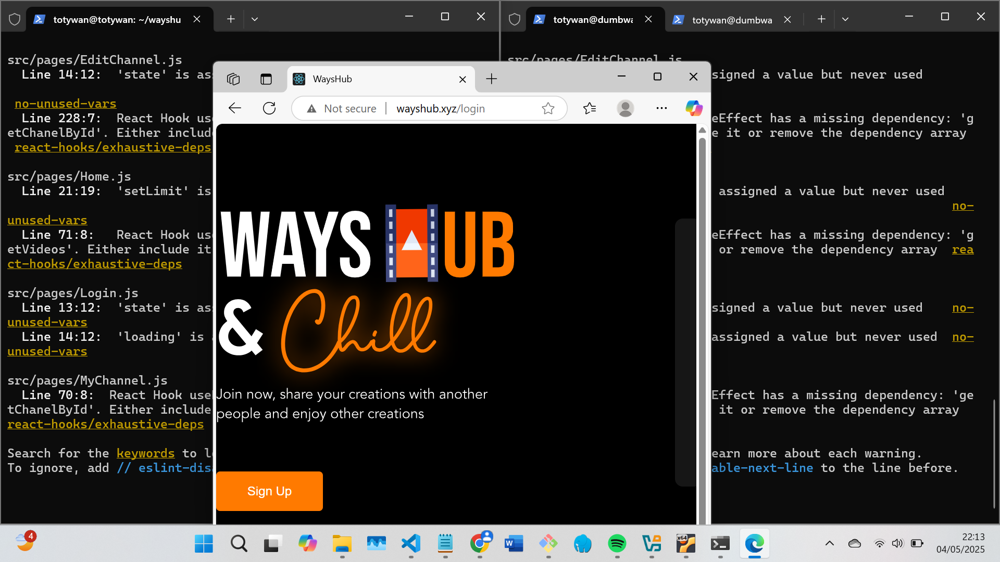

# 📘 Day 6 - CHALLENGE

## Load Balancing 2 Server

### Step by step:

1. Buat VM Ubuntu server baru.
2. Clone wayshub dengan menjalankan perintah `git clone https://github.com/dumbwaysdev/wayshub-frontend.git` di VM yang baru.
3. Jalankan aplikasi wayshub di kedua server

   

4. Konfigurasikan reverse proxy dengan metode load balancing misal seperti code di bawah:

```
upstream wayshub{
        server 192.168.1.208:3000;
        server 192.168.1.209:3000;
}
server {
        server_name wayshub.com;
                location / {
                        proxy_pass http://wayshub;
        }
}
```

5. lakukan tes dan restart/reload nginx
   

6. domain akan dapat diakses dan terdapat 2 server yang dapat menangani permintaan client
   
