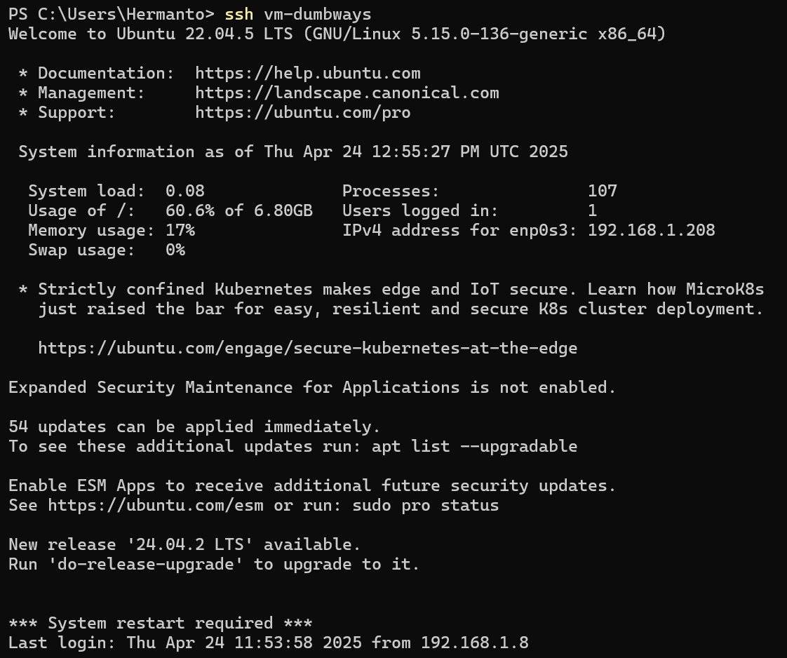
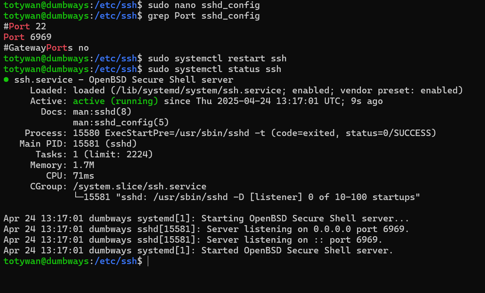
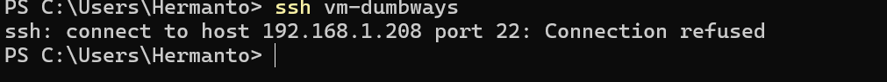
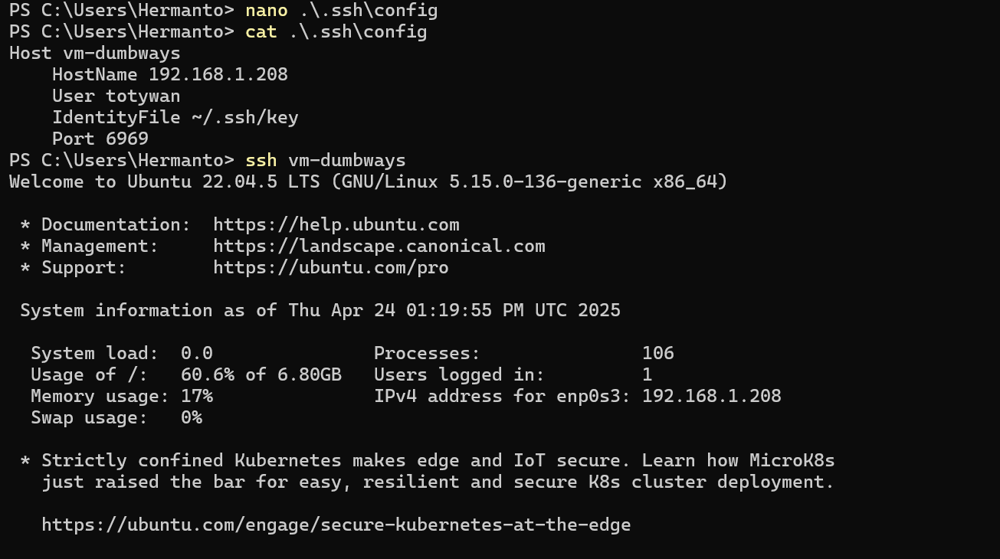
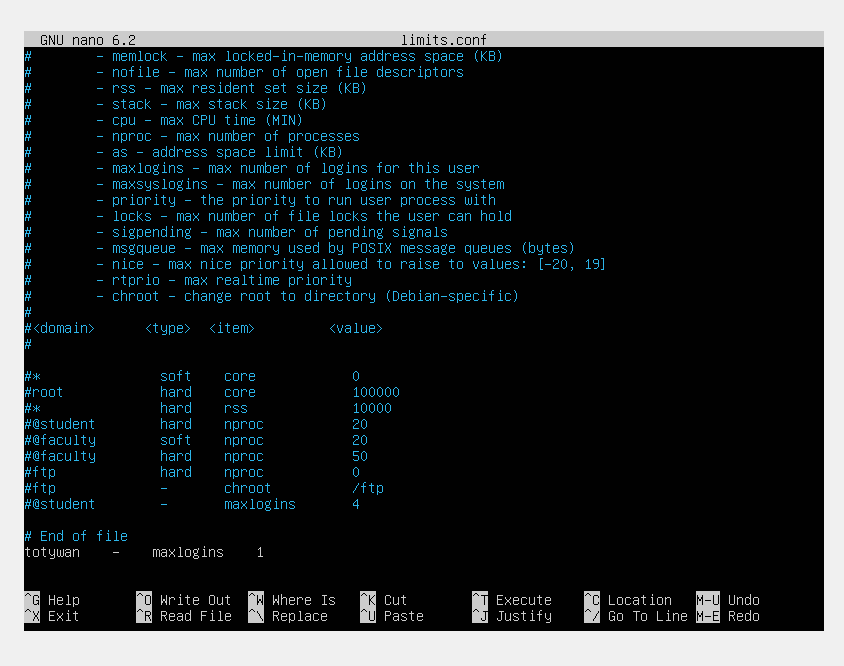
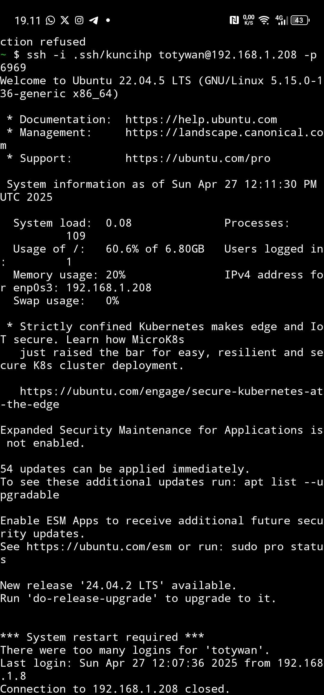

# 📘 Day 3 - CHALLENGE

## Menjalankan server dengan command "ssh vm-dumbways"

### Step by step:

- Di lingkungan windows terminal buat file config didalam .ssh, contoh :

```bash
nano ~/.ssh/config
```

- tambahkan konfigurasi berikut:

```bash
Host vm-dumbways
    HostName 192.168.1.208     # Ganti IP sesuai server
    User totywan               # Ganti dengan username di server
    IdentityFile ~/.ssh/key    # kunci untuk masuk ke server
    Port 22                    # Port default untuk mengakses ssh
```

- Jika sudah maka akan bisa meremote server menggunakan command `ssh vm-dumbways`
  

---

## Rubah Port SSH menjadi 6969

### Step by step:

1. Ubah konfigurasi Port server di dalam direktori `/etc/ssh/sshd_config` menjadi Port 6969 kemudian restart ssh server seperti gambar di bawah
   

2. Setelah selesai lakukan percobaan di windows terminal tanpa merubah port (Port default: 22)
   
3. Ubah konfigurasi file config menjadi port 6969, maka akan berhasil masuk ke server
   

---

## SSH Hanya Bisa Diakses 1 Device (How to prevent multiple connections in SSH)

### Step by step:

1. Tambahkan konfigurasi `username - maxlogins 1` pada file direktori `/etc/security/limits.conf`



2. restart ssh server `sudo systemctl restart ssh`
3. Maka apabila terdapat login di server melebihi batas yang ditentukan akan terblock
   
