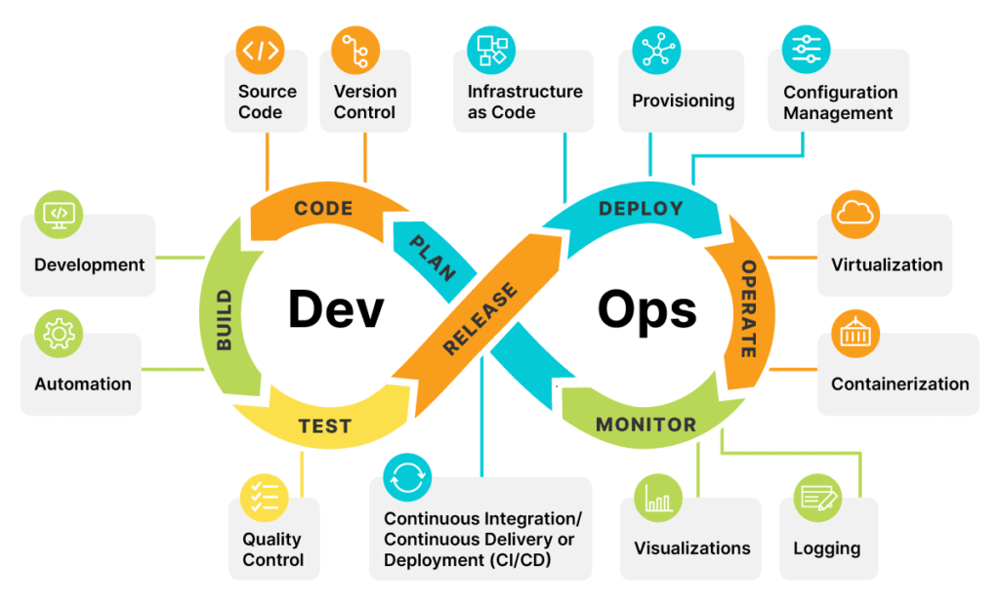

# Day 1 - DevOps Bootcamp Task

## ✅ Task 1: Jelaskan istilah DevOps dengan kata kunci: **Continuous**

DevOps adalah penghubung antara tim Development dan tim Operations yang bertugas untuk mempercepat proses development hingga produk dirilis ke publik.

DevOps erat kaitannya dengan sistem yang berkelanjutan (continuous) seperti ilustrasi gambar di bawah ini sehingga sistem yang berkelanjutan tersebut baiknya diotomasikan oleh DevOps.


**Continuous** dalam DevOps merujuk pada serangkaian praktik berkelanjutan yang memungkinkan proses pengembangan dan penyebaran aplikasi berjalan secara otomatis, cepat, dan konsisten. Beberapa istilah penting terkait "Continuous" antara lain:

- **Continuous Integration (CI):** Praktik menggabungkan (merge) kode dari banyak developer ke branch utama secara rutin, biasanya beberapa kali sehari. Setiap integrasi akan diuji secara otomatis agar bisa mendeteksi bug lebih awal.
- **Continuous Delivery (CD):** Proses otomatisasi pengiriman aplikasi ke lingkungan staging atau produksi, sehingga rilis dapat dilakukan kapan saja dengan lebih andal.

- **Continuous Deployment:** Tahapan lanjutan dari Continuous Delivery, di mana setiap perubahan kode yang lolos uji otomatis langsung di-deploy ke produksi tanpa campur tangan manual.

- **Continuous Monitoring:** Pemantauan sistem secara berkelanjutan untuk mendeteksi masalah performa, error, dan log setelah aplikasi dirilis.

Dengan menerapkan prinsip **Continuous**, tim dapat mempercepat proses pengembangan, memperkecil risiko, dan meningkatkan kualitas produk secara keseluruhan.

---

## ✅ Task 2: Membuat Virtual Machine

Saya telah membuat 1 virtual machine menggunakan [sebutkan alat yang digunakan, misal: Multipass / VirtualBox / VMware]. Screenshot VM dapat dilihat di bawah ini:

📷 **Screenshot VM** (akan ditambahkan nanti)

---

## ✅ Task 3: Install Nginx Web Server

Saya telah menginstal Nginx di dalam virtual machine. Berikut adalah langkah-langkah singkat instalasinya:

```bash
sudo apt update
sudo apt install nginx -y
```
