# Day 2

## ✅ Task 1: Diagram Jaringan IP Class C

**Skenario:**

- Gunakan IP Class C `192.168.11.xxx`
- CIDR Block: `192.168.11.0/30`
- Terdapat 4 device yang terhubung

### Mencari subnet

CIDR `/30` memiliki MAX IP 4, maka subnet mask bisa dicari dengan rumus`255.255.255.256-MAXIP`
sehingga CIDR `/30` memiliki subnet mask `255.255.255.252`, sehingga hanya menyediakan **2 alamat IP usable** untuk host, karena:

- 1 IP untuk network address
- 1 IP untuk broadcast
- 2 IP untuk host

Dengan hanya 2 IP usable per subnet, maka agar dapat menghubungkan 4 device, kita perlu **2 subnet berbeda**.

### 🔸 Diagram

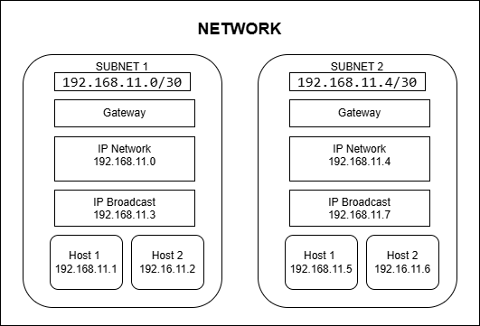

### Pembagian IP

- **Subnet 1:** `192.168.11.0/30`

  - Network: `192.168.11.0`
  - Host: `192.168.11.1`, `192.168.11.2`
  - Broadcast: `192.168.11.3`

- **Subnet 2:** `192.168.11.4/30`
  - Network: `192.168.11.4`
  - Host: `192.168.11.5`, `192.168.11.6`
  - Broadcast: `192.168.11.7`

---

## ✅ Task 2: Perbedaan SH dan BASH

Shell (`sh`) dan Bash (`bash`) adalah interpreter perintah (command-line interface) yang digunakan dalam sistem Unix/Linux. Keduanya digunakan untuk menjalankan perintah-perintah di terminal, membuat skrip otomatisasi, serta mengelola sistem.

### 📌 Tabel Perbedaan SH vs BASH

| **Fitur**          | **SH (Shell)**                                 | **BASH (Bourne-Again SHell)**                                                                 |
| ------------------ | ---------------------------------------------- | --------------------------------------------------------------------------------------------- |
| **Asal**           | Shell original dari Unix (Bourne Shell - `sh`) | Diperkenalkan oleh GNU Project sebagai pengganti `sh`, dengan fitur tambahan (`bash`)         |
| **Nama Lengkap**   | Bourne Shell                                   | Bourne-Again Shell                                                                            |
| **Kompatibilitas** | Tersedia di hampir semua sistem Unix/Linux     | Kompatibel ke belakang dengan `sh`, namun lebih modern dan powerful                           |
| **Interaktivitas** | Sederhana, minim fitur interaktif              | Mendukung fitur interaktif seperti autocomplete (`Tab`), history, prompt customization        |
| **Fitur Tambahan** | Hanya mendukung fitur dasar scripting shell    | Mendukung array, arithmetic expressions, command substitution, function, brace expansion dll. |
| **Error Handling** | Terbatas                                       | Lebih baik dalam penanganan error dan debugging                                               |
| **Performance**    | Lebih ringan karena fitur minim                | Sedikit lebih berat, namun sangat powerful untuk scripting                                    |
| **Digunakan di**   | Sistem lama, embedded system, init scripts     | Hampir semua distribusi Linux modern, termasuk Ubuntu, Fedora, macOS, dll                     |
| **Ekstensi File**  | `.sh`                                          | `.sh` atau `.bash`                                                                            |
| **Portabilitas**   | Lebih portabel antar Unix system               | Kurang portabel ke sistem non-Bash (jika menggunakan fitur Bash spesifik)                     |

---

### 🧠 Kesimpulan:

- **SH** cocok untuk membuat skrip yang sangat sederhana dan portabel karena kompatibilitasnya tinggi.
- **BASH** lebih cocok digunakan untuk pekerjaan sehari-hari di Linux dan membuat skrip kompleks karena kaya fitur.
- Dalam praktik modern, **Bash adalah standar de facto** pada sistem Linux karena kemudahan dan kemampuannya.

---

### 🔎 Contoh Perbedaan Script

**Script di SH:**

```sh
#!/bin/sh
echo "Hello from SH"
                       |
Script di BASH:
#!/bin/bash
name="Dumbways"
echo "Hello from $name"
```

---

## ✅ Task 3: Kumpulan Command Linux

Berikut adalah beberapa command Linux yang telah saya coba:

```bash
sudo apt update
```

Digunakan untuk melakukan update daftar package agar mendapatkan versi terbaru dari repository.

\*sudo: Menjalankan perintah sebagai administrator.

\*apt: Application/Package manager untuk distribusi berbasis Debian (seperti Ubuntu).

\*update: Menyegarkan daftar package yang tersedia dari repository.


```bash
mkdir nama_direktori
```

Digunakan untuk membuat folder baru


```bash
command --help
```

Digunakan untuk melihat perintah apa saja yang dapat diterapkan dalam command tersebut.

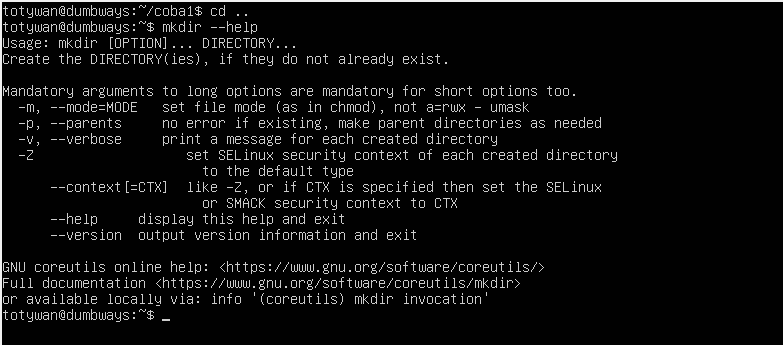

```bash
ls
ls -l
ls -la
```

Digunakan untuk melihat list


\*"-l" merupakan command tambahan untuk melihat list detail
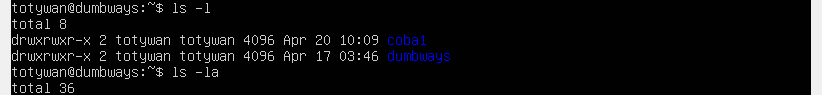

\*"-la" merupakan command tambahan untuk melihat list detail dan juga berkas hidden didalamnya
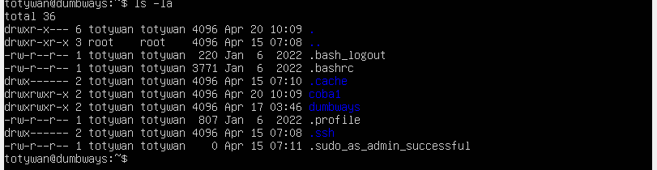

```bash
mkdir nama_direktori
```

Digunakan untuk membuat folder baru


```bash
touch nama_file
```

Digunakan untuk membuat file baru

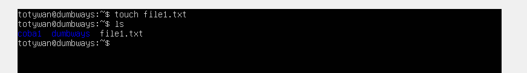

```bash
cp nama_file nama_file_baru
cp nama_file direktori/nama_file
mv nama_file direktori/nama_file
```

*cp digunakan untuk me-copy file
*mv digunakan untuk memindahkan file


```bash
cd nama_direktori
cd ../
```

*cd digunakan untuk memilih path atau direktory yang dituju
*cd ../ untuk naik ke path direktori parent dari path saat ini


```bash
nano file
```

Digunakan untuk membuka file menggunakan text editor sederhana

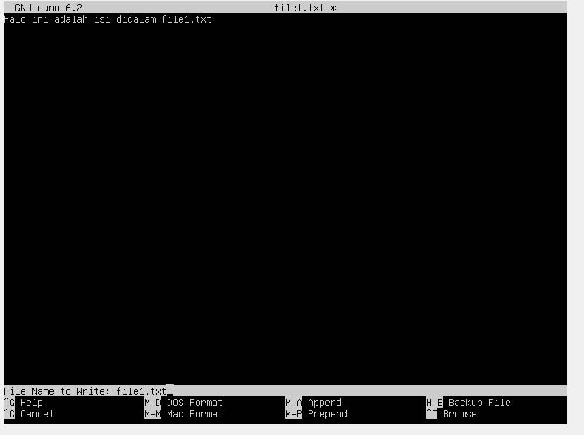

```bash
find
find -type
find -type -name
```

digunakan untuk mencari file/folder
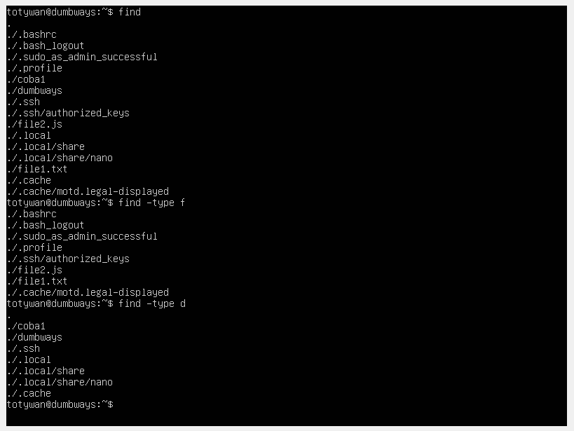


```bash
echo
cat
command > file
command >> file
```

*echo digunakan untuk menampilkan teks atau variabel
*cat digunakan untuk menampilkan isi dari file ke terminal

*command > file digunakan untuk meng-overwrite output dari commanf ke dalam file yang dituju
*command >> file digunakan untuk menambahkan (append) output dari commanf ke dalam file yang dituju


```bash
rm nama_file
pwd
```

*rm digunakan untuk menghapus file
*pwd (print work directory) digunakan untuk menampilkan path saat ini


```bash
grep string nama_file
```

Digunakan untuk mencari string tertentu didalam file
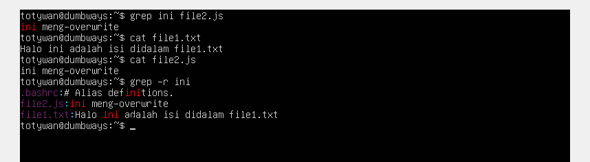

```bash
wc nama_file
```

Digunakan untuk menghitung jumlah baris, kata, dan karakter didalam file
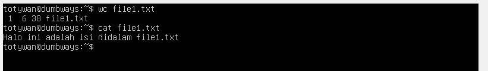

```bash
chmod permission nama_file
```

Digunakan untuk menambah permission eksekusi. 1=read 2=write 4=execute, dimana 7 berarti rwx (read, write, execute)
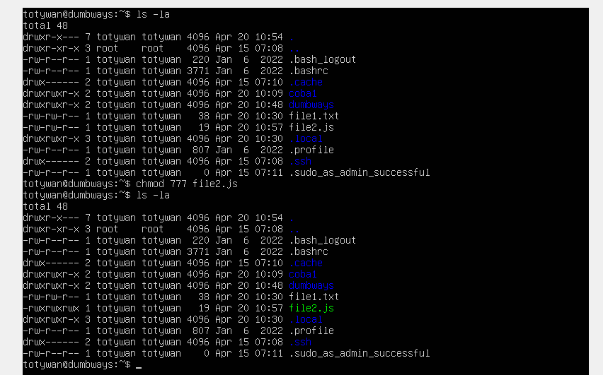
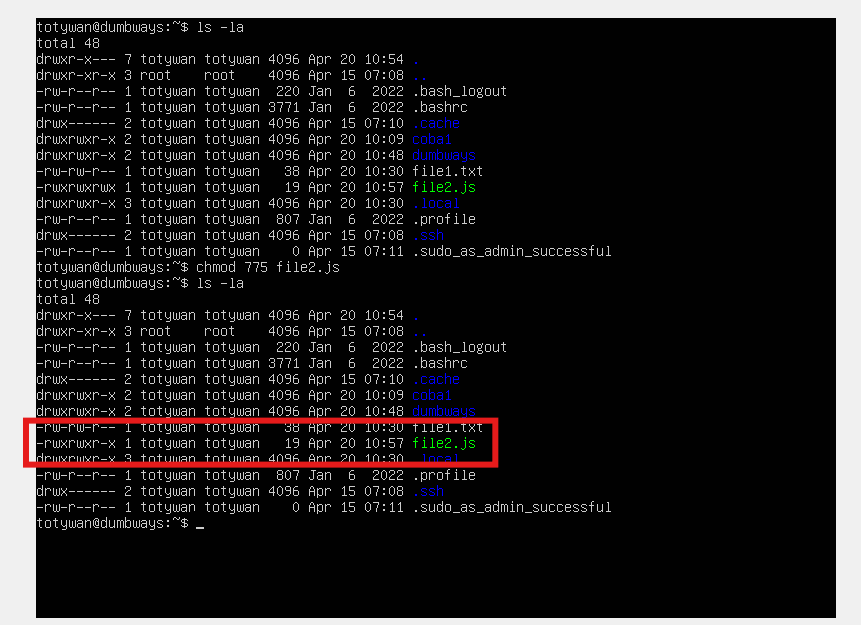

```bash
chown user:group file
```

Digunakan untuk menukar kepemilikan
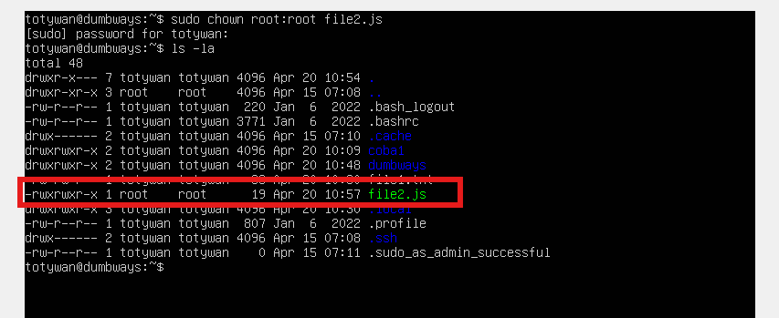

```bash
sudo su
```

Digunakan untuk beralih dari user ke root

NB: tekan CTRL+D untuk kembali ke user
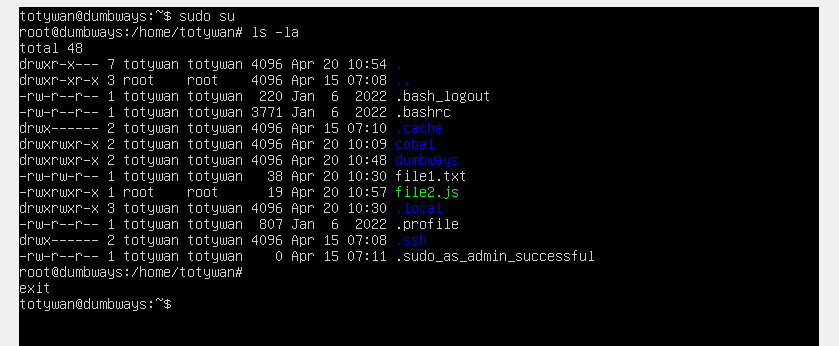

```bash
whoami
```

Lihat user saat ini
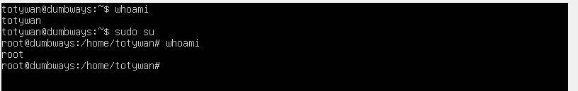

```bash
!!
```

Digunakan untuk menjalankan perintah sebelumnya

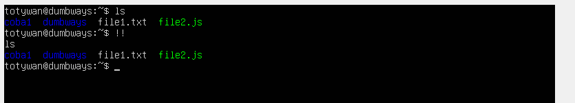

```bash
alias nama_alias="command"
```

Digunakan untuk membuat istilah pada command yang diinginkan

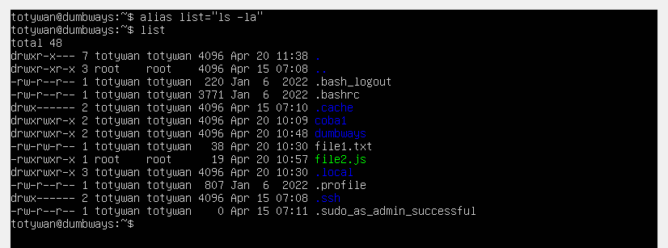

```bash
free -h
du -h
df -h
```

*free -h penggunaan RAM
*du -h penggunaan disk
\*df -h ukuran folder

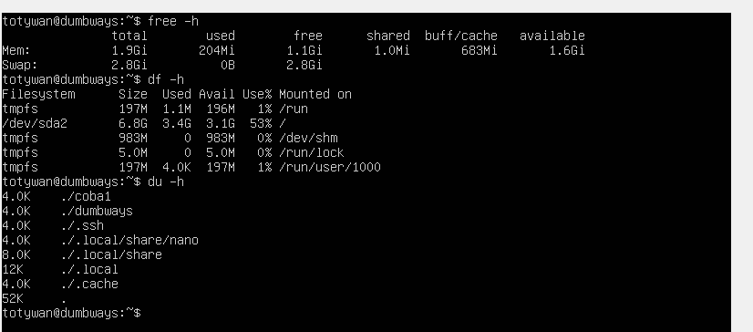

```bash
history
```

melihat history command yang telah dijalankan
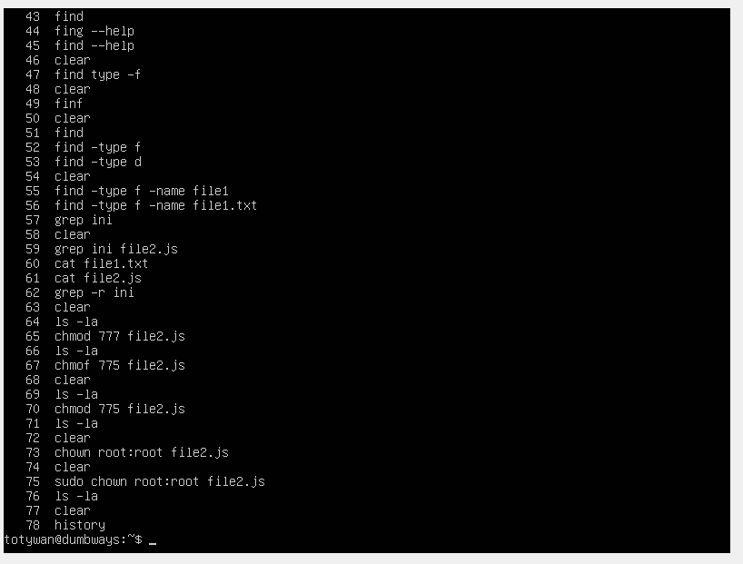

```bash
sudo apt install nama_package
```

Menginstall package
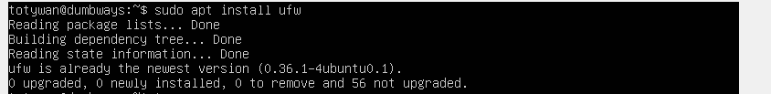

```bash
ip a
```

Lihat ip device
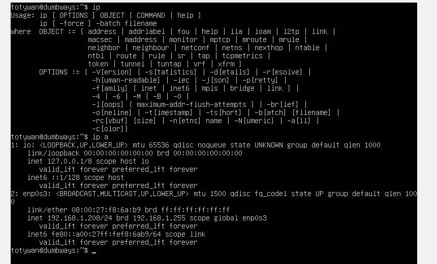
