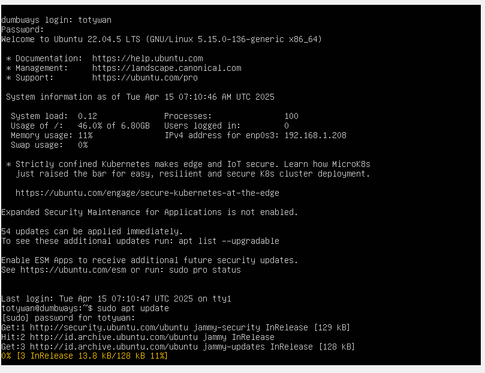

# Day 2

## ✅ Task 1: Diagram Jaringan IP Class C

**Skenario:**

- Gunakan IP Class C `192.168.11.xxx`
- CIDR Block: `192.168.11.0/30`
- Terdapat 4 device yang terhubung

### 🔹 Penjelasan

CIDR `/30` memiliki subnet mask `255.255.255.252`, sehingga hanya menyediakan **2 alamat IP usable** untuk host, karena:

- 1 IP untuk network address
- 1 IP untuk broadcast
- 2 IP untuk host

Dengan hanya 2 IP usable per subnet, maka agar dapat menghubungkan 4 device, kita perlu **2 subnet berbeda**.

### 🔸 Diagram

### 🧠 Pembagian IP

- **Subnet 1:** `192.168.11.0/30`

  - Network: `192.168.11.0`
  - Host: `192.168.11.1`, `192.168.11.2`
  - Broadcast: `192.168.11.3`

- **Subnet 2:** `192.168.11.4/30`
  - Network: `192.168.11.4`
  - Host: `192.168.11.5`, `192.168.11.6`
  - Broadcast: `192.168.11.7`

---

## ✅ Task 2: Perbedaan SH dan BASH

| **Fitur**          | **SH (Shell)**               | **BASH (Bourne-Again SHell)**                                   |
| ------------------ | ---------------------------- | --------------------------------------------------------------- |
| **Asal**           | Unix Shell original (Bourne) | Pengembangan dari SH                                            |
| **Fitur**          | Minimal, hanya dasar         | Lebih powerful (auto-complete, history, array, arithmetic, dll) |
| **Kompatibilitas** | Kompatibel dengan semua Unix | Kompatibel ke belakang dengan SH                                |
| **Interaktivitas** | Kurang interaktif            | Lebih user-friendly                                             |
| **Digunakan pada** | Sistem lama/scripting basic  | Sistem modern (Linux, MacOS, dll)                               |

---

## ✅ Task 3: Kumpulan Command Linux

Berikut adalah beberapa command Linux yang telah saya coba:

```bash
sudo apt update
```

Digunakan untuk melakukan update daftar package agar mendapatkan versi terbaru dari repository.

sudo: Menjalankan perintah sebagai administrator/root.

apt: Package manager untuk distribusi berbasis Debian (seperti Ubuntu).

update: Menyegarkan daftar package yang tersedia dari repository.


