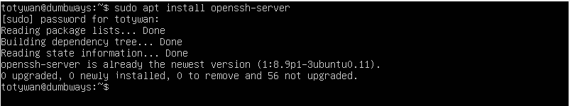
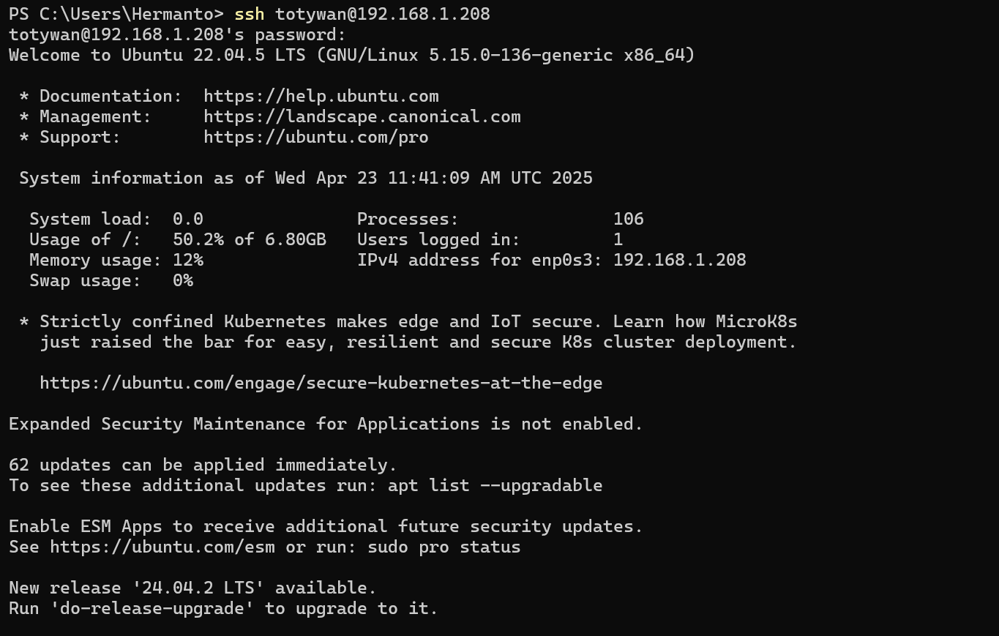
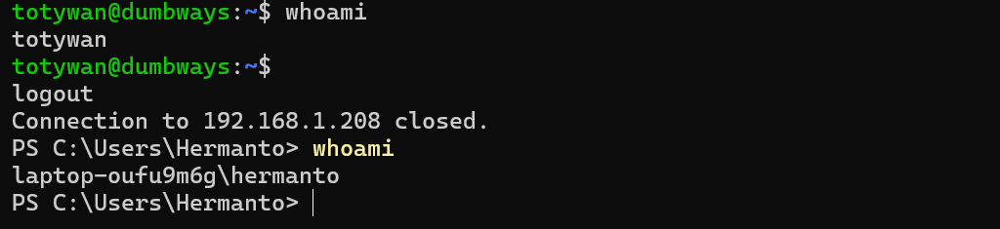
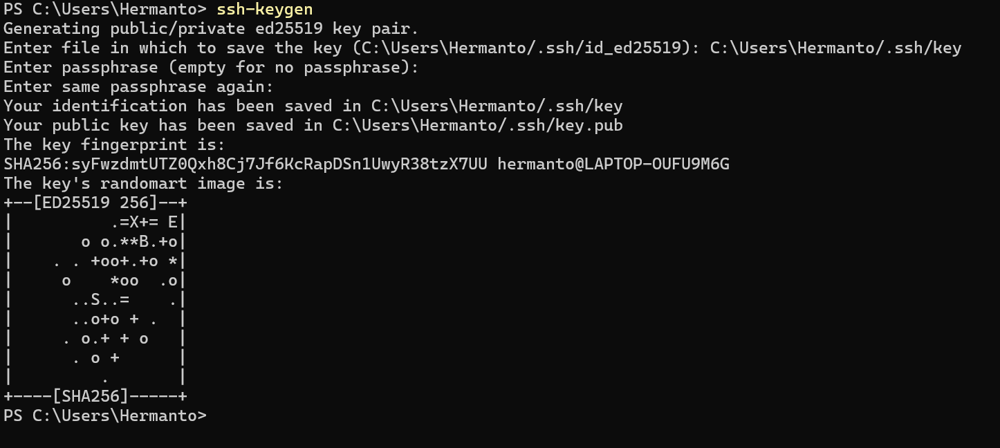
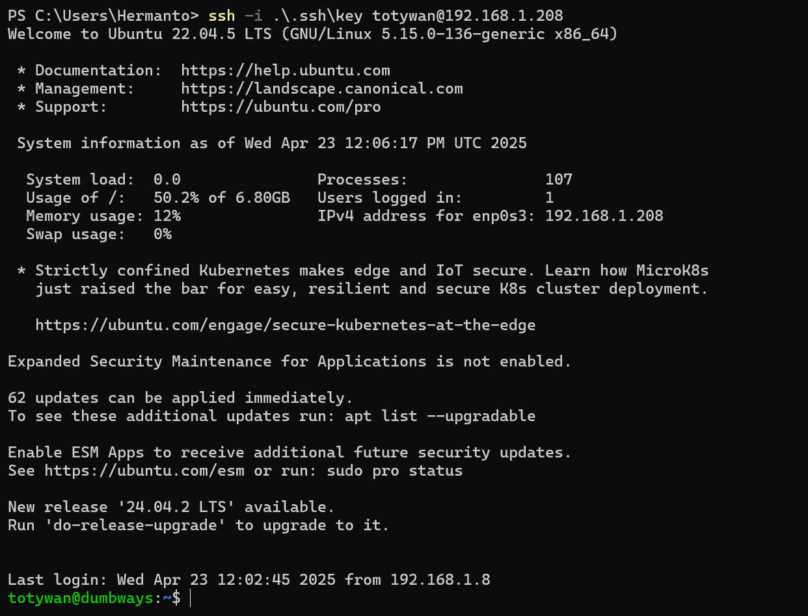
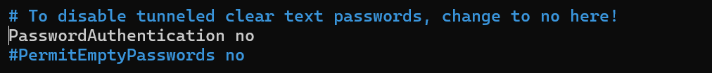
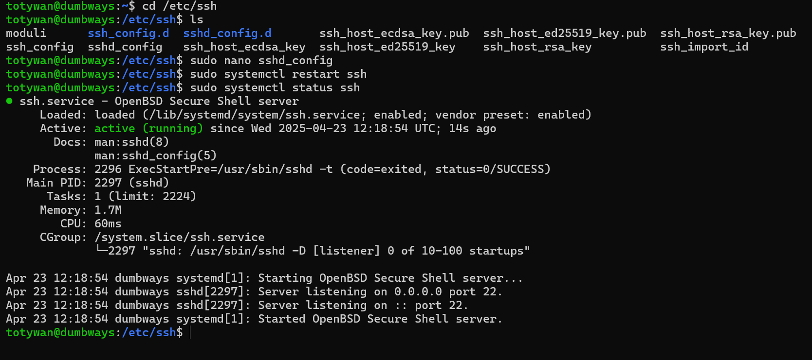
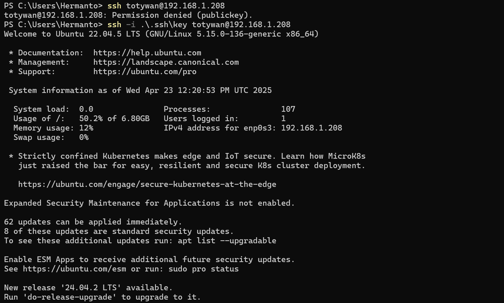

# Day 3

## ✅ Task 1: Akses Server via Windows Terminal

Langkah-langkah:

- Pada server install openssh server dengan menggunakan command

```bash
sudo apt install openssh-server
```



- Apabila OpenSSH telah terinstall, lalu jalankan Windows Terminal sebagai administrator dan berikan command

```bash
ssh username@ip-server
```

> ip server bisa dilihat dengan menggunakan command "ip a" pada server



> CTRL + D digunakan untuk keluar dari server yang dijalankan pada windows terminal
> 

---

## ✅ Task 2: Konfigurasi SSH dengan Public Key Only (Password Disabled)

Langkah-langkah:

- Generate SSH Key di Client:

```bash
ssh-keygen
```



- Input password dari file "key.pub" yang sudah digenerate kedalam file authorized keys pada direktori .ssh milik server


- Apabila sudah maka client dapat mengakses server tanpa memasukkan password menggunakan file key yang dimilikinya dengan cara

```bash
ssh -i .ssh/key username@ip-server
```



- Untuk membuat agar client tanpa public key tidak bisa mengakses server, maka dapat konfigurasi pada file sshd_config (/etc/ssh/sshd_config) dan mengubah baris `PasswordAuthentication no` seperti pada gambar.



- Restart ssh server dengan menggunakan command

```bash
sudo systemctl restart ssh
```



- Selesai, Client yang tidak memiliki Public Key tidak dapat me-remote server



---

## ✅ Task 3: Text Manipulation (grep, sed, cat, echo)
