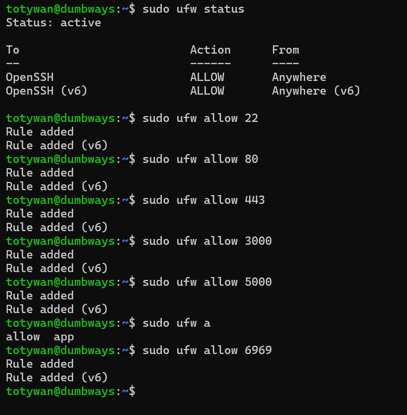

# Day 3

## ✅ Task 1: Akses Server via Windows Terminal

Langkah-langkah:

- Pada server install openssh server dengan menggunakan command

```bash
sudo apt install openssh-server
```


- Apabila OpenSSH telah terinstall, lalu jalankan Windows Terminal sebagai administrator dan berikan command

```bash
ssh username@ip-server
```

> ip server bisa dilihat dengan menggunakan command "ip a" pada server


> CTRL + D digunakan untuk keluar dari server yang dijalankan pada windows terminal
> 

---

## ✅ Task 2: Konfigurasi SSH dengan Public Key Only (Password Disabled)

Langkah-langkah:

- Generate SSH Key di Client:

```bash
ssh-keygen
```


- Input password dari file "key.pub" yang sudah digenerate kedalam file authorized keys pada direktori .ssh milik server


- Apabila sudah maka client dapat mengakses server tanpa memasukkan password menggunakan file key yang dimilikinya dengan cara

```bash
ssh -i .ssh/key username@ip-server
```


- Untuk membuat agar client tanpa public key tidak bisa mengakses server, maka dapat konfigurasi pada file sshd_config (/etc/ssh/sshd_config) dan mengubah baris `PasswordAuthentication no` seperti pada gambar.


- Restart ssh server dengan menggunakan command

```bash
sudo systemctl restart ssh
```


- Selesai, Client yang tidak memiliki Public Key tidak dapat me-remote server


---

## ✅ Task 3: Text Manipulation (grep, sed, cat, echo)

- `grep` bisa digunakan untuk mencari string tertentu (bersifat key sensitif) dalam suatu file. Misalnya untuk kasus mengganti `PasswordAuthentication` pada `sshd_config`.
- Kemudian `sed` dapat mengganti string didalam file dengan string baru yang diinginkan. Misalnya menggan `PasswordAuthentication no` menjadi `PasswordAuthentication yes` pada `sshd_config`. sintaks command untuk `sed` = `sed -i "s/string_yang_ingin_diganti/string_pengganti/g" nama_file`


- `echo` memberikan output teks atau variabel dan dapat digunakan untuk menambahkan baris baru dan teks kedalam file dengan bantuan operator `>>`. Misalnya jika ingin menambahkan key baru kedalam `authorized_keys` didalam folder `.ssh/`.
- Kemudian untuk mengecek apakah sudah key yang ingin ditambah tadi sudah masuk atau belum dapat menggunakan perintah `cat`. `cat` juga dapat digunakan untuk mengisi isi file langsung dengan menggunakan operand `> nama_file` lalu tekan CTRL + C apabila telah menuliskan isi dari file tsb.

## 

---

## ✅ Task 4: Nyalakan ufw dengan memberikan akses untuk port 22, 80, 443, 3000, 5000, 6969

- Cek status ufw apakah firewall aktif atau tidak dengan menggunakan command

```bash
sudo ufw status
```

- Apabila belum active dan OpenSSH belum diberi akses ke firewall, dapat menggunakan command

```bash
sudo ufw enable
sudo ufw allow "OpenSSH"
```



- Apabila sudah muncul seperti gambar diatas, maka allow akses untuk port 22, 80, 443, 3000, 5000,6969

```bash
sudo ufw allow 22
sudo ufw allow 80
sudo ufw allow 443
sudo ufw allow 3000
sudo ufw allow 5000
sudo ufw allow 6969

```


