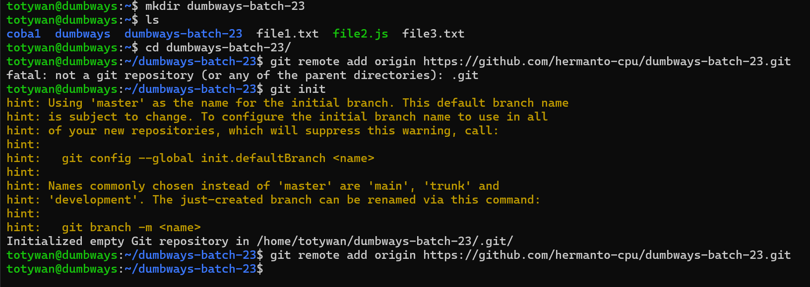
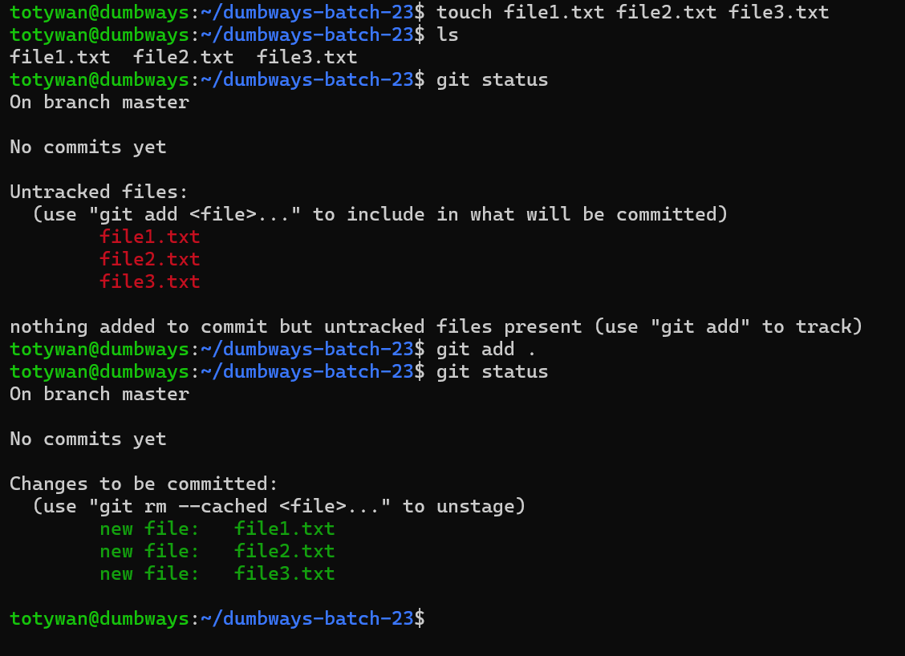
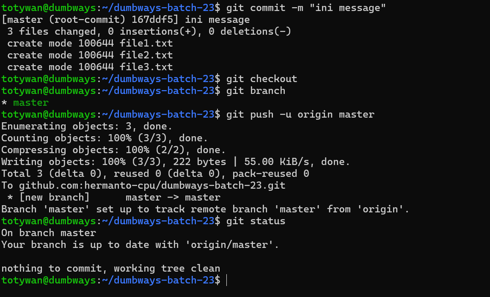
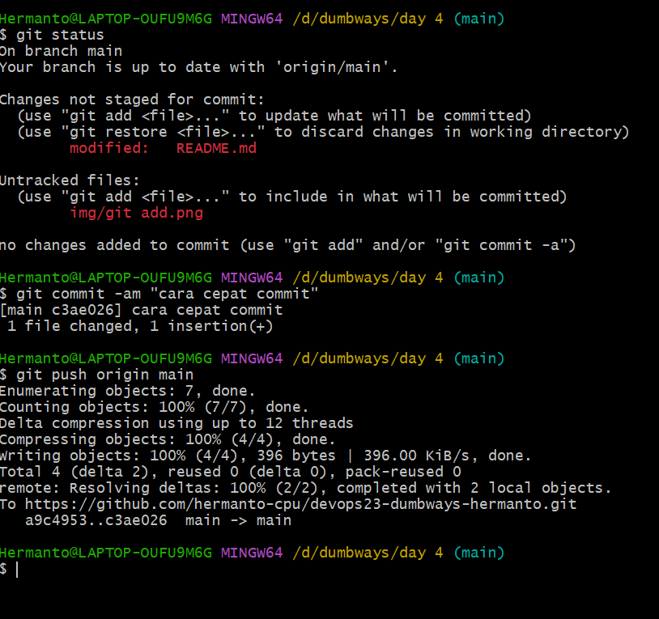
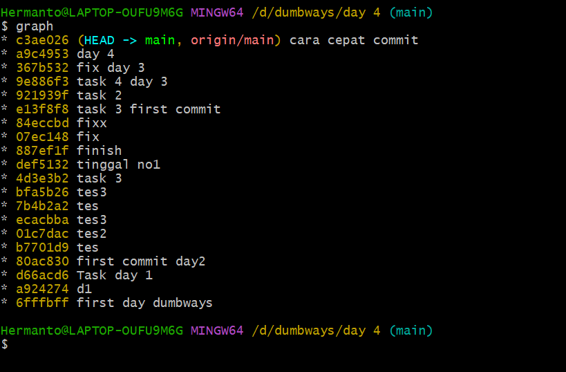

# 📘 Day 4 - Version Control System

## ✅ Task 1: Penjelasan Tentang Git

**Git** adalah VCS terdistribusi yang digunakan untuk mencatat perubahan dalam berkas atau sekumpulan berkas. Git bisa dikatakan sebuah software yang digunakan untuk mengelola perubahan file didalam folder. Git memungkinkan banyak orang bekerja secara bersamaan, menyimpan versi perubahan, dan melacak histori perubahan pada kode.

### Fitur Utama Git:

- Menyimpan histori perubahan
- Kolaborasi dalam pengembangan project
- Branching dan merging
- Integrasi dengan GitHub/GitLab/Bitbucket

---

## ✅ Task 2: Membuat Repository bernama `dumbways-batch-23`

### 📍 Step by step:

1. Login ke akun GitHub
2. Buat repository baru dengan klik button **New Repository**
3. Isi form:
   - Repository Name: `dumbways-batch-23`
   - Description: _Repositori latihan batch 23_
   - Visibility: Public
4. Klik tombol **Create Repository**
5. buat direktori dengan nama yang sama di lokal, kemudian initialisasi git di direktori tersebut dan remote repository yang telah dibuat dengan mengetikkan perintah:
   ```bash
   git init
   git remote add origin https://github.com/username-github/dumbways-batch-23.git
   ```
   
6. buat 3 file, lalu push ke repository menggunakan command:

```bash
touch file1.txt file2.txt file3.txt
git add .
git commit -m "pesan"
git push origin master
```




---

## ✅ Task 3: Manage Repository Tugas (devops23-dumbways-<nama>) via Terminal

### 📍 Step by step:

1. Buka terminal (saya menggunakan git bash) lalu masuk ke direktori yang diinisialisasikan dengan repo githubnya.
2. buat folder day 4 dan mengerjakan task di file "README.md"
3. tambahkan file dan folder yang sudah baru dibuat dengan `git add .`
4. lakukan commit dengan `git commit -m "message"`
5. setelah selesai lakukan push dengan `git push origin <nama-branch>`
   
   > NB :
   >
   > - Jika file hanya di modifikasi (tidak membuat file baru) maka melakukan commit bisa menggunakan `git commit -am "pesan"` kemudian dapat langsung di push ke repo
   > - lakukan alias untuk command `git log --all --decorate --oneline --graph` misalnya `alias graph ="git log --all --decorate --oneline --graph"` untuk meninjau track repository kita dengan grafik yang enak untuk dilihat dan mudah dipahami
   >    > 
