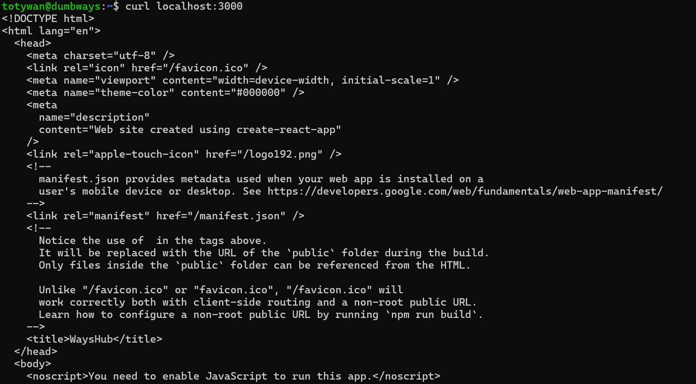
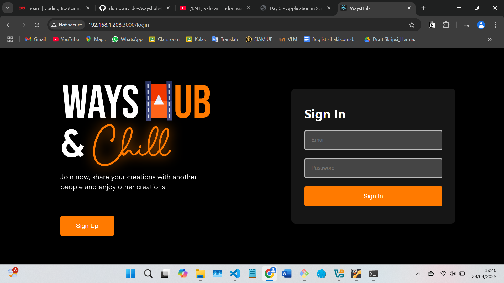
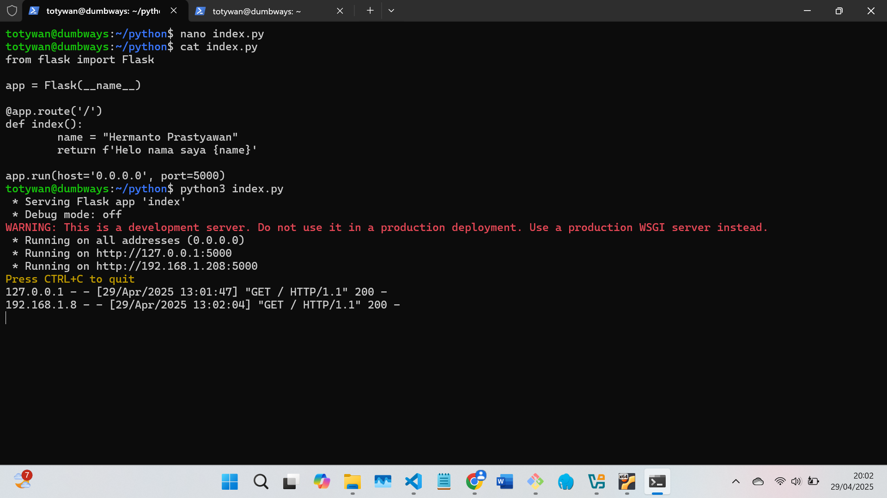
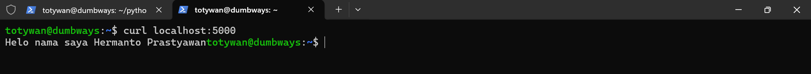
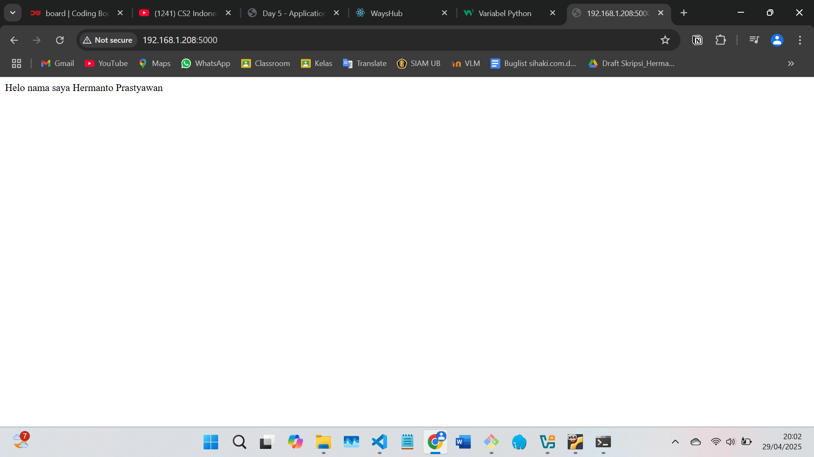
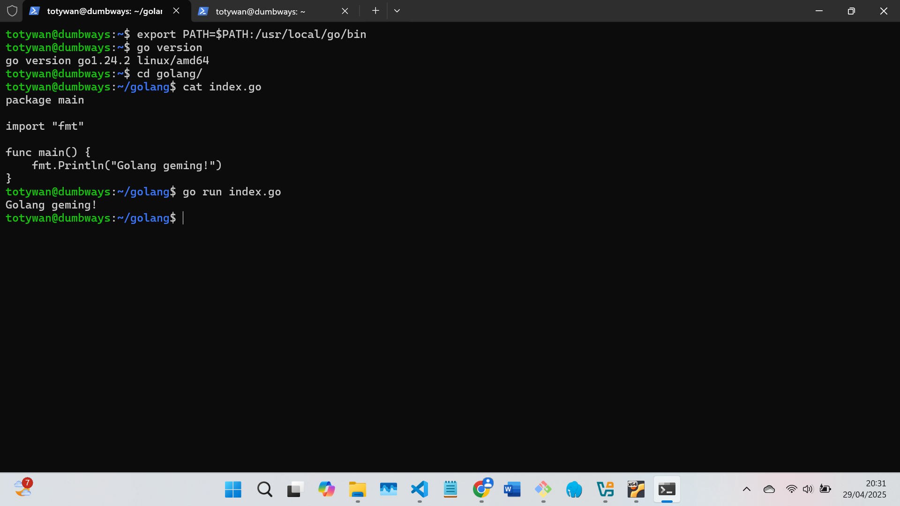

# 📘 Day 5 - TASK

## NODE.JS

- Deploy app wayshub-frontend
- Berjalan di Port 3000
- Menggunakan Node.js 13

```bash
git clone https://github.com/dumbwaysdev/wayshub-frontend.git
cd wayshub-frontend
nvm install 13
npm install
npm start
```




---

## Python

- Deploy app menampilkan text nama kalian!
- Berjalan di port 5000 & bisa dibuka melalui web

buat file `.py` yang berisikan :

```bash
from flask import Flask

app = Flask(__name__)

@app.route('/')
def index():
        name = "Hermanto Prastyawan"
        return f'Helo nama saya {name}'

app.run(host='0.0.0.0', port=5000)
```





---

## Golang

- Deploy app menampilkan text "Golang geming!"

buat file `.go` yang berisikan :

```bash
package main

import "fmt"

func main() {
    fmt.Println("Golang geming!")
    }
```


