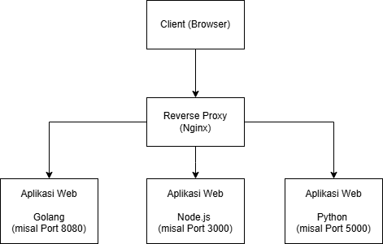

# 📘 Day 6 - TASK

## 1. Gambarkan sturktur web server menggunakan reverse proxy dan jelaskan cara kerjanya!



- Reverse Proxy adalah server yang menerima permintaan dari client (misalnya browser), lalu meneruskan permintaan itu ke server lain di belakangnya (misalnya aplikasi kamu yang jalan di port 3000 atau 5000), dan akhirnya mengirimkan kembali responnya ke client.

### Cara Kerja :

1. Client buka browser dan akses http://hermanto.xyz.

2. DNS mengarahkan ke IP server (192.168.1.208).

3. Nginx yang berjalan di port 80 menerima permintaan ini.

4. Nginx mengecek konfigurasi: "kalau ada permintaan ke hermanto.xyz, teruskan ke localhost:3000".

5. Aplikasi web (misal wayshub) menerima permintaan itu dan memberikan respon berupa isi aplikasi web.

6. Nginx menerima respon dari wayshub dan meneruskannya ke browser.

7. Browser menampilkan isi websitenya.

---

## 2. Membuat Reverse Proxy untuk aplilkasi wayshub dengan domain hermanto.xyz

### Step by step:

1. Tambah konfigurasi DNS untuk IP server yang digunakan web server di dalam file hosts di direktori `Windows/System32/Drivers/etc/host`. Tambahkan dapat menggunakan notepad yang telah di jalankan sebagai administrator.
   

2. Setelah selesai buat konfigurasi di direktori `/etc/nginx/sites-enabled/` misalnya saya membuat `hermanto.conf`
   
3. Jalankan tes konfigurasi dan apabila tidak ada error bisa merestrart/mereload nginx dengan perintah:

```bash
sudo nginx -t
sudo systemctl restart nginx
```


4. Akses domain di web browser maka akan diarahkan reverse proxy ke alamat IP dan port yang telah ditentukan
   
